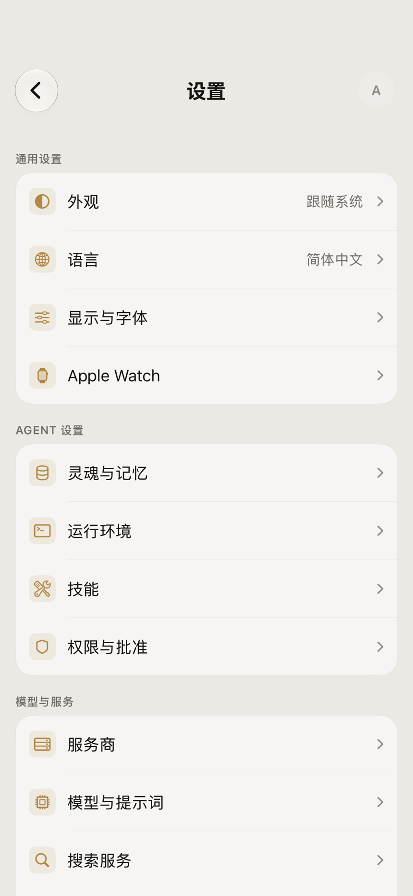
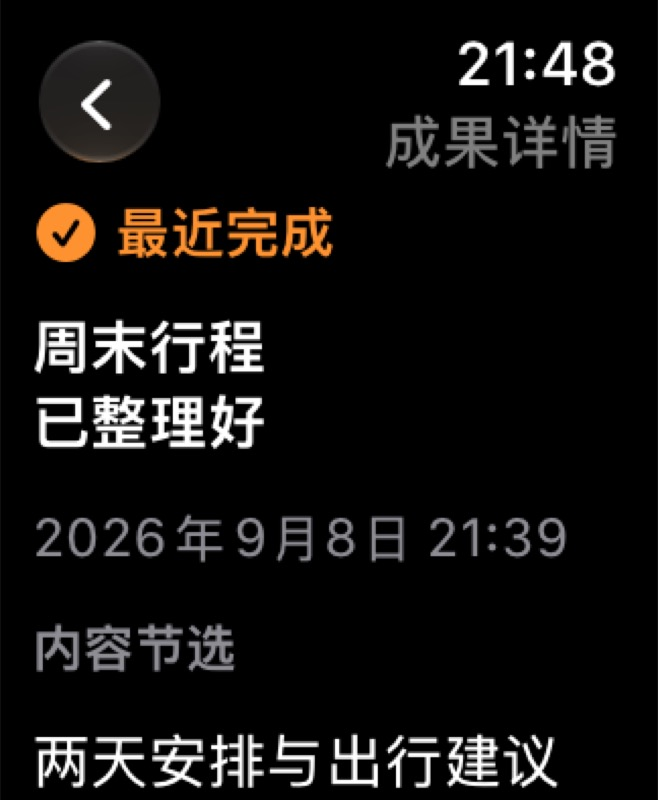

<p align="center">
  
</p>

<h1 align="center">AmberAgent for iOS</h1>

<p align="center">把模型、工具与工作空间放在一处的原生 iPhone / iPad AI 助手。</p>
<p align="center"><sub>A native AI assistant for iPhone and iPad, with configurable models, approval-based tools, and an Apple Watch companion.</sub></p>
<p align="center"><sub>SwiftUI · Kotlin Multiplatform · iOS 26+ · watchOS 11+</sub></p>

## 看看 Amber

| iPhone 设置 | Apple Watch 首页 | Apple Watch 结果回看 |
| :---: | :---: | :---: |
|  |  |  |

<sub>图片来自模拟器界面与视觉测试，使用合成演示数据。Watch 依靠 iPhone 管理模型、会话及工具执行。</sub>

## 能做什么

- **选择自己的模型服务**：配置 OpenAI 兼容接口、Gemini、Claude 等 provider，管理模型、会话和提示词。
- **让工具执行有边界**：Agent 可以发起多轮工具调用；需要授权的操作由用户审批，并保留拒绝和失败结果。
- **把任务接着做下去**：在工作空间中组织对话、记忆、阅读与创作；技能、MCP 和远程运行等扩展能力按需配置。
- **在手腕上接续**：Apple Watch 提供快捷提问、最近动态和结果回看，与 iPhone 协同工作。

这是一个持续开发中的项目。部分能力需要先在应用内配置模型服务或开启对应设置；Apple Watch 不是独立运行完整 Agent 的设备。

## 开始构建

需要 macOS、带 iOS 26 SDK 的 Xcode、XcodeGen 和 JDK 17。稳定版 `iosApp` target 还需要先生成本地 CPython 制品；[准备脚本说明](iosApp/AmberShellPythonRuntime/README.md)记录了固定来源与校验方式。

```bash
# 在仓库根目录执行；首次构建 CPython 需要下载并编译固定版本源码
iosApp/scripts/prepare-ambershell-python.sh

# Xcode 工程由 project.yml 生成，不提交生成后的 .xcodeproj
(cd iosApp && xcodegen generate)

# Xcode 构建阶段会生成并嵌入本仓的 Shared.framework
xcodebuild -project iosApp/AmberAgent.xcodeproj \
  -scheme iosApp -destination 'generic/platform=iOS Simulator' build
```

只需验证共享层时，可在 Apple Silicon Mac 上运行 `./gradlew :shared:linkDebugFrameworkIosSimulatorArm64`。`iosApp/project.yml` 是 Xcode 工程的配置来源；当前 KMP 代码仍在这个 iOS 仓库中构建，并未作为独立的 Core 制品发布。

## 仓库结构

| 路径 | 内容 |
| --- | --- |
| [`iosApp/`](iosApp/) | SwiftUI 应用、Watch App、Widget 与 XcodeGen 配置 |
| [`shared/`](shared/) · [`ai-core/`](ai-core/) · [`ai-provider-openai/`](ai-provider-openai/) · [`ai-provider-claude/`](ai-provider-claude/) | iOS 使用的 KMP 共享层与 provider 实现 |
| [`core/`](core/) · [`feature/`](feature/) | 本仓过渡期的共享能力与功能模块 |
| [`native/`](native/) | 原生组件 |

## 许可与反馈

使用、修改或分发前请阅读 [LICENSE](LICENSE)：本仓采用分段双重许可，商业使用另有授权条件。发现问题或希望讨论功能，可以到 [Issues](https://github.com/soul99soul-glitch/AmberAgent-iOS/issues) 交流。
