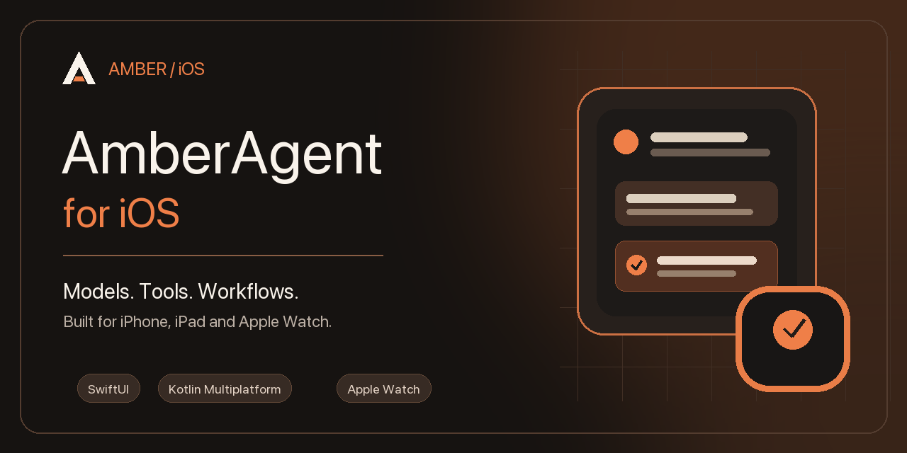
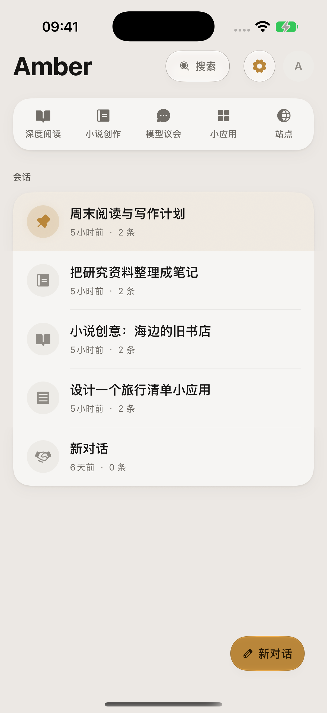
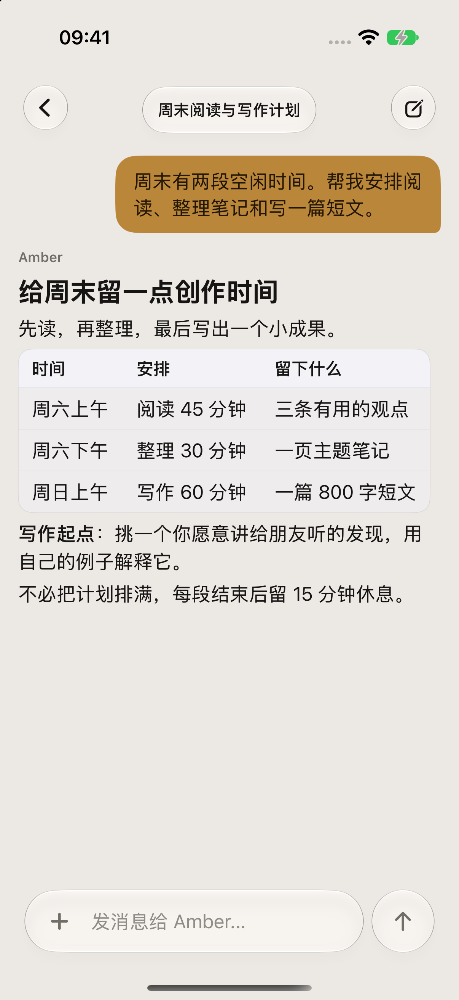
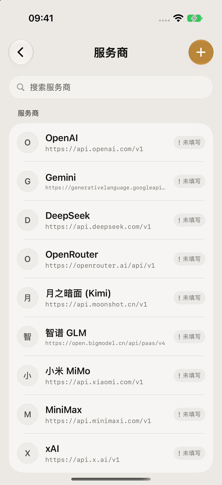
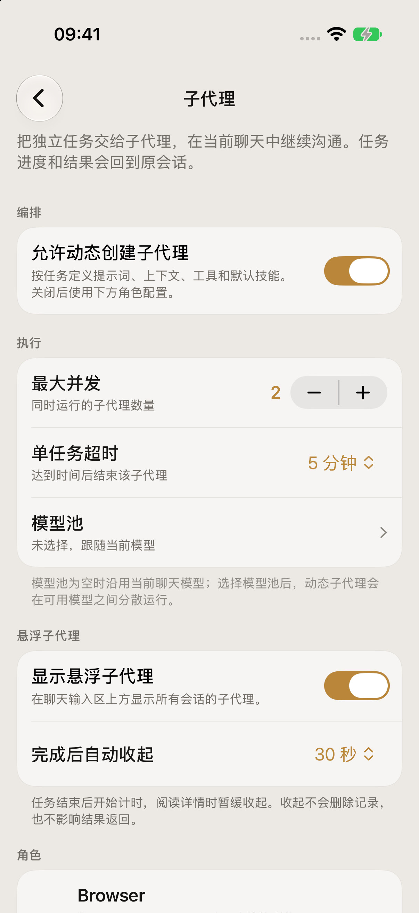
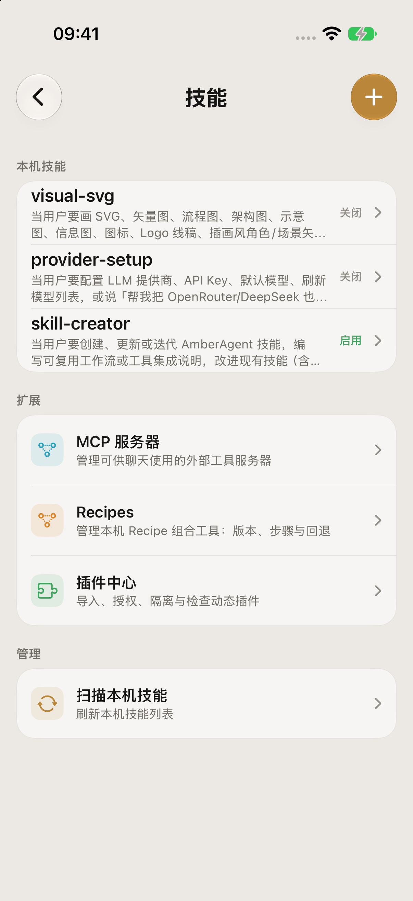
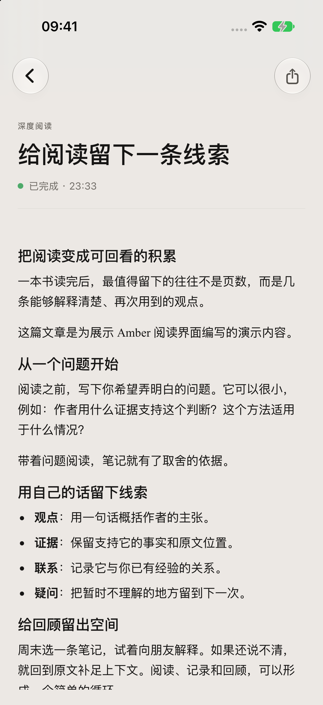
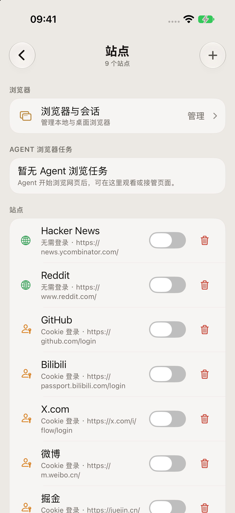
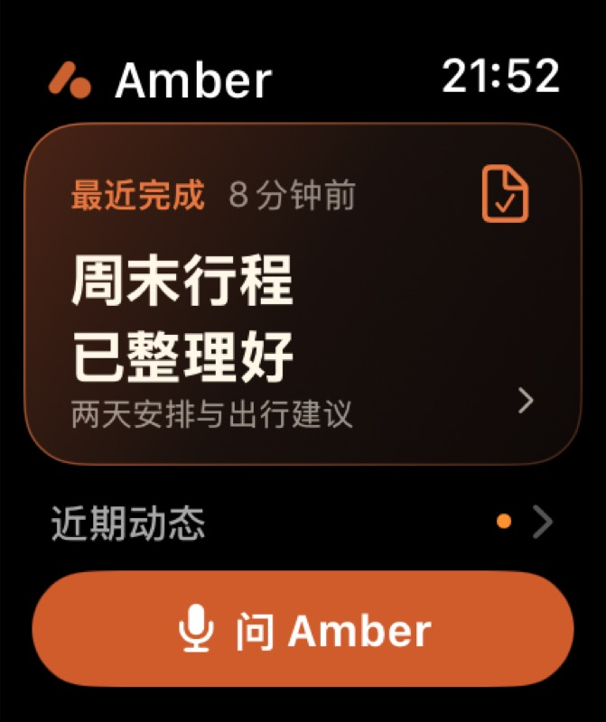

<p align="center">
  
</p>

<h1 align="center">AmberAgent for iOS</h1>

<p align="center">把模型、工具、阅读与创作放进一款原生 iPhone / iPad 助手。</p>
<p align="center"><sub>A native AI assistant for iPhone and iPad, with configurable models, approval-based tools, and an Apple Watch companion.</sub></p>
<p align="center"><sub>SwiftUI · Kotlin Multiplatform · iOS 26+ · watchOS 11+</sub></p>

AmberAgent 将多模型聊天、工具执行和专门的阅读、创作工作区放在同一个原生应用中。你可以先问一个问题，再带入文件、分派子任务、整理一篇文章，或把故事继续写进小说项目。模型服务、工具范围和执行权限由你配置。

[对话与模型](#对话与模型) · [Agent 协作](#让-agent-接手一部分工作) · [阅读与文件](#阅读文件与-workspace) · [小说创作](#小说创作) · [首次使用](#第一次使用) · [构建](#构建)

<p align="center">
  
  
  
</p>
<p align="center"><sub>对话首页 · 聊天 · 模型服务商</sub></p>

<sub>iPhone 17 Pro / iOS 27 模拟器实拍。对话与阅读文章是人工编写的演示数据，用于展示实际界面与排版。<a href="docs/assets/readme/iphone/README.md">截图说明</a></sub>

## 对话与模型

从会话列表开始一段新对话，也可以回来接着处理旧任务。聊天支持流式回复、Markdown、代码与多轮工具调用。输入区可拍照、从照片图库选图或从 Files 选择文件；发送前能检查、移除图片和文件上下文。发出的消息可编辑、删除或重新生成，也可以在已有回答版本间切换。图片理解能力取决于当前模型；需要时可另外配置视觉模型。

AmberAgent 不绑定单一模型厂商。你可以配置 OpenAI 兼容接口、Gemini、Claude 等服务，保存 API Key、维护模型列表，并为聊天及辅助任务分别选择模型。API Key 存在系统 Keychain。截图中的列表只是设置入口，使用前需要填入自己的服务地址和凭据；可用模型与能力由对应服务商决定。

## 让 Agent 接手一部分工作

工具可以搜索、读取文件、管理 Workspace 或操作已配置的服务。应用按能力开关管理可用范围；需要审批的操作会在聊天中展示目标与影响，用户可以批准或拒绝。拒绝、失败和中断状态会保留在任务结果中。

子代理适合把较独立的工作交出去，例如让一个角色浏览资料，同时在原会话继续推进。进度与结果会返回发起任务的对话，并可在输入区上方查看活动状态。你可以调整并发数、超时时间，以及各角色的提示词、模型、工具和默认技能；也可以按任务启用动态子代理。角色选中的工具仍受服务器开关和应用审批策略约束。iOS 切换到其他 App 后的后台运行时间受系统调度限制。

<p align="center">
  
  
</p>
<p align="center"><sub>子代理 · 技能与扩展</sub></p>

技能以本机文件管理，可以启用、编辑，并分配给子代理角色。MCP 服务器需要你手动配置或导入，支持 Streamable HTTP 和 SSE；连接后可以管理服务器及单个工具的开关。MCP 凭据类请求头单独保存在 Keychain。没有配置服务或启用相应能力时，这些扩展不会自动提供外部功能。

## 阅读、文件与 Workspace

Deep Read 把一个主题和已有材料整理成可继续阅读的文章。来源可以包括手动文本、当前对话、搜索结果、用户选择的文件，或当前已加载的 WebMount 网页；生成结果可呈现摘要、时间线、关键脉络、图解、分析、扩展阅读与参考来源，并可保存为 Workspace Artifact。

Workspace 集中保存用户主动导入的文件与应用生成结果，聊天、工具、小应用和 Deep Read 都可将内容放入其中。通过系统文件选择器导入资料后，可以把文件带入对话上下文；单文件上限为 20 MB，文本预览支持 txt、md、json、csv、pdf 和 docx 等格式。搜索和网页抓取需要配置相应服务，阅读结果可结合原始资料继续核对和补充。

<p align="center">
  
</p>

## 网页、小应用与多模型讨论

WebMount 在应用内打开你配置的站点，Agent 可以读取当前页面并执行范围受控的浏览操作；你可以观看和接管浏览器任务。登录、验证码和支付等步骤会请求你接管。也可以连接远程桌面浏览器；对应的 MCP 服务需要使用 iPhone 可访问的 HTTPS 地址。

在聊天中描述一个小工具，例如计时器或信息面板，AmberAgent 可以生成本机 Mini App。你能在列表查看、运行和管理它的版本、授权与调用记录。联网搜索、公开 HTTPS fetch、AI 生成、剪贴板和系统交互等能力按项申请；本机或私网地址不会作为公开网络请求放行。

模型议会把同一议题交给多个席位从不同角度讨论，再由主持流程整理结论。席位可配置各自的模型、角色提示和讨论模式；也可选择动态组建席位。联网调研是可选设置，依赖已配置的搜索服务，会增加等待时间和模型调用量。历史讨论可以回看。

<p align="center">
  
</p>

## 小说创作

小说项目把世界观、人物、大纲、章节、创作对话与剧情状态放在一起维护。三个主要入口分别处理创作讨论、正文和设定，便于从构思持续写到成稿。

- **试写不同走向**：从检查点另开剧情分支，保留原来的故事线；章节有版本记录，可回看和恢复。
- **先讨论，再采纳**：共创时检查 AI 提供的故事种子、设定建议和候选正文，再决定是否纳入项目；代笔模式按已确认的章节合同推进。
- **维护长篇上下文**：组织人物与世界观，制定章节计划，进行连续性检查、单章或批量润色。
- **带走创作成果**：通过项目导入导出保存或迁移作品。写作与审阅模型可分别配置。

## 第一次使用

1. **连接模型服务**：进入“设置 → 服务商”，选择服务商，填写 API Key 与接口地址，或使用该服务支持的登录方式。
2. **选择要使用的模型**：获取或手动添加模型，在“模型与提示词”中选择聊天默认模型，再回到首页开始对话。
3. **按任务增加能力**：需要联网阅读时配置搜索服务；需要外部工具时添加 MCP 服务器并启用工具；需要协作时设置子代理角色、模型与技能。Workspace 和系统能力也按需开启。

## 本地数据与使用边界

会话记录保存在设备的 `Documents/conversations` JSON 文件中，并标记为不纳入系统备份；Workspace 文件保存在应用本地目录。服务商 API Key 与敏感 MCP 请求头放在 Keychain。选中模型后，对话内容、图片和相关上下文会传给对应服务商处理；配置搜索或 MCP 时，相应请求也会发往你选择的服务。项目不提供自带模型账号或搜索额度。

项目仍在持续开发。后台续跑受 iOS 系统调度和服务商能力影响；部分工具需先开启能力开关、授予系统权限或连接外部服务。

## Apple Watch

Watch App 配合 iPhone 查看近期任务、状态和结果，适合在手腕上快速确认进度或发起简短提问。会话、模型和工具执行由配对的 iPhone 提供。

<p align="center">
  
</p>

## 构建

需要 macOS、带 iOS 26 SDK 的 Xcode、XcodeGen 和 JDK 17。工程配置来源是 `iosApp/project.yml`，生成后的 Xcode 工程不提交。两个 iOS scheme 都会从本仓 Gradle 工程构建并嵌入 `Shared.framework`，KMP 目前仍是本仓的 iOS 过渡实现。

常规 scheme `iosApp` 包含 iPhone/iPad、Watch、Widget 和 CPython 集成。以下以 Apple Silicon Mac 的模拟器构建为例，先准备 CPython 制品，再生成 Xcode 工程：

```bash
# 首次准备固定版本的 CPython iOS 制品
iosApp/scripts/prepare-ambershell-python.sh

(cd iosApp && xcodegen generate)

xcodebuild -project iosApp/AmberAgent.xcodeproj \
  -scheme iosApp -destination 'generic/platform=iOS Simulator' \
  ARCHS=arm64 EXCLUDED_ARCHS=x86_64 CODE_SIGNING_ALLOWED=NO build
```

实验 scheme `iosAppExperimentalGPL` 使用独立 bundle ID 与实验 entitlement，并额外集成 iSH 运行时资源和 `IshEmbed` 依赖。它也需要 CPython 制品和本仓生成的 `Shared.framework`：

```bash
xcodebuild -project iosApp/AmberAgent.xcodeproj \
  -scheme iosAppExperimentalGPL -destination 'generic/platform=iOS Simulator' \
  ARCHS=arm64 EXCLUDED_ARCHS=x86_64 CODE_SIGNING_ALLOWED=NO build
```

只需构建共享框架时，可在 Apple Silicon Mac 运行 `./gradlew :shared:linkDebugFrameworkIosSimulatorArm64`。

## 仓库结构

| 路径 | 内容 |
| --- | --- |
| [`iosApp/`](iosApp/) | SwiftUI 应用、Watch App、Widget 与 XcodeGen 配置 |
| [`shared/`](shared/) · [`ai-core/`](ai-core/) · [`ai-provider-openai/`](ai-provider-openai/) · [`ai-provider-claude/`](ai-provider-claude/) | iOS 使用的 KMP 共享层与 provider 实现 |
| [`core/`](core/) · [`feature/`](feature/) | 本仓过渡期的共享能力与功能模块 |
| [`native/`](native/) | 原生组件与 iOS framework |

## 许可与反馈

使用、修改或分发前请阅读 [LICENSE](LICENSE)：本仓采用分段双重许可，按用途及用户规模规定适用条件，商业使用另有授权要求。

欢迎通过 [Issues](https://github.com/soul99soul-glitch/AmberAgent-iOS/issues) 报告问题或讨论功能。报告问题时请附 iOS 版本、应用版本、复现步骤及预期行为；截图和日志请先移除个人信息与凭据。代码修改请遵守仓库的 [AGENTS.md](AGENTS.md)，并附与改动对应的验证结果。
