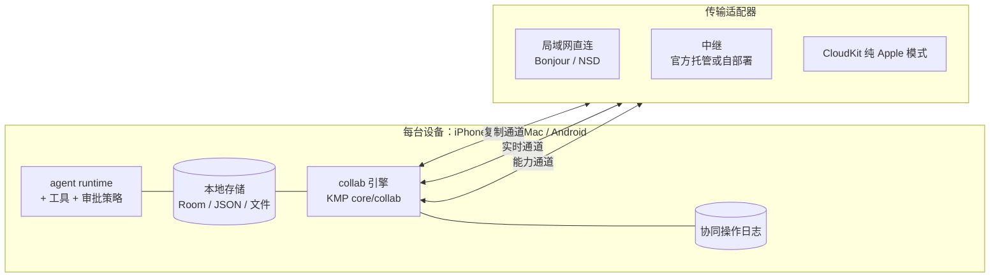

# Amber 跨设备协同与 Mac 端设计（草案 v0.1）

状态：设计草案，未实现。本文记录已确认的产品决策、Mac 移植 spike 的实测证据，以及协同协议的第一版设计。协议字段和阶段划分在进入实现前仍可调整。

## 1. 已确认的决策

| 问题 | 决策 |
| --- | --- |
| 桌面平台 | 只做 macOS（Apple Silicon） |
| 设备关系 | 对等：每台设备都能独立执行，不存在固定“主机” |
| 连接方式 | 官方托管中继与用户自部署中继都支持；另有不依赖中继的纯 Apple 模式 |
| 与 Android | 共用同一套协同协议 |
| 两端离线并发续写同一会话 | 接受自动分叉（语义见 5.3，与最初设想的“同会话内兄弟分支”不同） |
| Mac 分发 | Developer ID 签名 + 公证，独立分发，不上 Mac App Store |

由这些决策推出的约束：

- 协议不能依赖 CloudKit schema、Swift 类型或 APNs。线上格式由 KMP `commonMain` 定义，加密原语放在 Rust `native/sync-crypto`，iOS、macOS、Android 三端共用。
- 中继是跨平台的基线通道。Bonjour、CloudKit、APNs、iCloud Keychain 只作为 Apple 设备之间的加速或增强，协议语义不能依赖它们。
- 对等执行下，“同一个 run 只能有一个执行者”必须由协议强制，不能靠约定。

## 2. 现状与 Mac 移植 spike 证据（2026-09-25）

### 2.1 代码分布

- `iosApp/iosApp` 共 314 个 Swift 文件（约 27.8 万行）。其中 182 个不 import SwiftUI/UIKit，51 个 import UIKit，14 个依赖 HealthKit、WorkoutKit、AlarmKit、ActivityKit 或 WatchConnectivity（Mac 上不可用或语义不同）。
- KMP 约 4.1 万行，`settings.gradle.kts` 纳入的 35 个模块只声明了 `jvm()`、`iosArm64()`、`iosSimulatorArm64()`。平台代码很少：4 个 `iosMain` 文件（日志、会话文件读写、Room 建库、任务文件），另有若干 `nativeMain` 文件（自动覆盖 macOS）。
- 可直接复用为协同底座的现有能力：`core/agent-runtime` 的 `AgentEventStore`、`agent_run` 持久化（Room schema 当前为 v5）、`Surface<STATE, COMMAND>`；`core/conversation-storage` 的 `forkConversation`；Swift 侧 `IOSConversationThreadEdge`、`IOSRunRecovery`、`IOSMcpClient`。
- 现有“同步”（`core/sync`、`IOSSyncBackup`、`IOSCloudKitSyncProvider`）是加密整包备份与恢复，不是增量协同。其中 PBKDF2 + AES-GCM 的做法可以沿用，归档格式不直接复用。

### 2.2 spike 做法

用仓库外的 Gradle init 脚本给所有 KMP 模块临时加 `macosArm64()`，未改动任何受跟踪文件：

- macOS 编译复用 `src/iosMain/kotlin`。
- 两个 provider 模块为 macOS 加 `ktor-client-darwin`。
- `core:agent-store-room` 加 `kspMacosArm64` Room 编译器。
- `core:native` 为 macOS 建 cinterop，复用 iOS 头文件。
- `shared` 导出同名 `Shared.framework`。
- Rust `amber-ffi` 另行编译为 `aarch64-apple-darwin` 静态库。

### 2.3 结果

| 检查 | 结果 |
| --- | --- |
| `:shared:linkDebugFrameworkMacosArm64` | 成功，产出 arm64 动态 `Shared.framework` |
| macOS 原生 KMP 测试（`macosArm64Test`，所有含 `commonTest` 的模块） | 42 个用例全部通过 |
| Swift 命令行探针链接 macOS 框架并运行 | Room/SQLite 建库、`startRun`、`getRun` 读回 `RUNNING`；Rust FFI `sha256` 返回 32 字节；`markdownToHtml` 输出正确 |
| `shared` 的 `commonTest` 编译 | 失败，原因是 `KotlinNativeBridgeThrowsContractTest` 在 `commonTest` 里用了 `System`、`java.io.File`；`compileTestKotlinIosSimulatorArm64` 同样失败，属于既有问题，非 macOS 引入 |

spike 发现、正式移植必须处理的问题：

1. **Room KSP 依赖的添加时机。** 在 `afterEvaluate` 中添加 `kspMacosArm64` 依赖太晚，`kspKotlinMacosArm64` 会被跳过；链接虽然成功，但缺少 `AgentRuntimeDatabaseConstructor`，运行时无法建库。正式改动必须和现有 iOS 一样在 `dependencies {}` 中声明。
2. **Rust release profile 的 `strip = "symbols"` 会作用于过程宏。** 本机 rustc 1.96 下，过程宏 dylib 被剥离符号后无法加载（E0463 can't find crate）。需要 `[profile.release.build-override] strip = false`。这是否也影响现有 iOS 制品构建尚未验证：本机未安装 iOS Rust target。
3. **数据目录。** `IosDatabaseFactory` 使用 `NSDocumentDirectory`，Swift 侧有 20 个文件使用 Documents 目录。非沙盒 Mac 上这会写进用户的 `~/Documents`，必须统一改为 `~/Library/Application Support/AmberAgent`，并由一个路径所有者提供。
4. **`native/AmberNative.xcframework` 缺少 macOS slice**，`build-xcframework.sh` 需要增加 `macos-arm64`。

## 3. 总体架构



三条逻辑通道共用同一种加密信封（第 4 节），传输层可以替换：

- **复制通道**：持久数据的增量合并，允许延迟，必须最终一致（第 5 节）。
- **实时通道**：run 事件流、插话、审批、取消、接力，要求低延迟，不保证离线送达（第 6 节）。
- **能力通道**：跨设备调用工具，采用请求/响应（第 7 节）。

## 4. 身份、配对与信封

### 4.1 设备身份

- 每台设备首次启用协同时生成两对密钥：Ed25519 用于签名，X25519 用于密钥协商。私钥只存本机 Keychain（Android 用 Keystore），不可导出、不同步。
- `deviceId` 等于签名公钥的 SHA-256 前 16 字节（base32 编码），无法伪造。

### 4.2 设备组与配对

- 设备组由一份签名的成员名单（roster）描述：`groupId`、成员公钥、设备名、平台、加入时间和名单版本号。每次变更都要由某个现有成员签名，版本号单调递增。
- 配对流程：
  1. 新设备展示二维码，内容为公钥、一次性配对码、候选传输地址。
  2. 已加入的设备扫码。
  3. 两端显示相同的 6 位指纹，由用户确认。
  4. 已加入的设备签发新名单，并下发当前的组状态。
- 移除设备：签发不含该设备的新名单。此后所有信封不再为它加密，中继同时吊销它的收件箱令牌。已下发的历史数据无法撤回，需要在界面上明确告知用户。

### 4.3 信封（线上最小单位）

```
Envelope {
  protocol: "amber-collab/1.0"   // 主版本不兼容即拒收；次版本向前兼容
  groupId, senderDeviceId, seq    // seq 按发送设备单调递增，用于防重放和去重
  channel: replicate | live | capability
  recipients: [{ deviceId, wrappedKey }]
  nonce, ciphertext               // AES-256-GCM 加密正文
  signature                       // 发送方 Ed25519 签名，覆盖以上全部字段
}
```

- 正文使用一次性内容密钥加密。内容密钥按接收方逐个包装：X25519 协商后经 HKDF-SHA256 派生包装密钥，语义等同 HPKE base mode。
- `ring 0.17` 已提供 X25519、Ed25519、HKDF、AES-GCM，扩展 `sync-crypto` 不需要新依赖。自行组合的加密构造上线前必须经过独立安全评审。
- 中继和 CloudKit 只能看到 `groupId`、设备 id、seq 和密文长度。
- 兼容性：遇到未知的次版本字段和未知操作类型，接收方必须保留原样并参与转发和存储，不能丢弃，以免旧版本客户端破坏新数据。三端共用一组 golden 测试向量（信封、操作、合并结果），放在 KMP `commonTest`，Android 仓库引用同一版本。

## 5. 复制通道

### 5.1 操作日志

- 每台设备只往自己的日志里追加操作：`(deviceId, seq, hlc, op)`。`hlc` 为混合逻辑时钟，用于跨设备排序和 LWW 比较；时间相同时按 `deviceId` 字典序决胜。
- 同步只交换“对方缺少的 `(deviceId, seq)` 区间”，由每端维护的版本向量计算。
- 定期压缩：所有成员都确认过的前缀可以折叠成快照。
- 本地存储仍是运行时的唯一读写入口。collab 引擎把本地写入翻译成操作，再把远端操作应用回本地存储；应用远端操作必须走和本地写入相同的存储所有者，不能另开写路径。

### 5.2 合并规则

| 数据 | 操作 | 规则 |
| --- | --- | --- |
| 会话元数据（标题、置顶、记忆模式、助手） | `conv.set(field)` | 按字段 LWW |
| 会话消息 | `node.append(convId, nodeId, afterNodeId, message)`、`node.addVariant(nodeId, message)`、`node.select(nodeId, messageId)`、`message.edit`、`node.delete` | 见 5.3；`select` 以 messageId 而非下标引用，按 LWW 处理；删除用墓碑 |
| 助手、提示词、服务商与模型配置 | `entity.set(path)` | 按字段 LWW；API Key 字段不参与复制 |
| 技能、MCP 服务器配置 | `entity.put` / `entity.delete` | 按条目 LWW；MCP 凭据请求头不参与复制 |
| 记忆条目 | `memory.put` / `memory.delete` | 按条目 LWW；合并整理产生的新条目作为普通 put 处理 |
| 小说章节 | `chapter.version(parentVersionId)` | 版本是不可变节点；同一父版本出现两个子版本时双双保留，标记“待选择”，不自动合并正文 |
| Workspace 文件 | `blob.ref(sha256, size, meta)` | 内容寻址；元数据按 LWW；数据块加密，按需拉取 |

只复制最终消息。流式中间态只走实时通道，避免日志膨胀。

### 5.3 会话并发语义（修正）

现有模型 `Conversation.messageNodes` 是线性列表，每个 `MessageNode` 只存同一位置的多个候选版本（`selectIndex`），不是树。因此“两端同时续写后形成同会话内的兄弟分支”在现有模型里无法表达。采用两层机制：

1. **在线时防止冲突**：某个会话有活动 run 时，只有持有该 run 租约的设备可以追加节点（第 6 节）。其他设备的输入作为插话（steer）发给执行方，或提示“正在 Mac 上运行，是否接管”。
2. **离线并发时分叉为新会话**：两端都在同一个 `afterNodeId` 之后追加时，HLC 较早的一方留在原会话；另一方在分叉点之后的节点，通过现有 `forkConversation` 语义移入新会话。新会话继承分叉点之前的内容，并写入一条父子线程关系（origin 为 `sync_conflict`）。两端对同一冲突必须得出完全相同的结果（确定性合并，由 golden 测试保证）。界面在两个会话里都提示“此会话在另一台设备上分叉”。

同一节点上新增候选版本（重新生成）不算冲突，直接合并进 `messages` 即可。

### 5.4 首批复制范围

- **第一批**：会话（最终消息）、助手与提示词、服务商与模型配置（不含 Key）、技能、MCP 服务器配置（不含凭据头）、记忆。这些数据体量小、价值高，能覆盖“换设备接着聊”的主路径。
- **第二批**：Workspace 文件（先同步元数据，内容按需拉取，默认不预下载）、小说项目。
- **默认不复制**：
  - 生成图片库，后续可提供独立开关。
  - 各类缓存和派生索引，由各端自行重建。
  - 运行中状态，走实时通道。
  - API Key 与 OAuth 会话，见 5.5。

### 5.5 密钥与登录态

- API Key 默认不复制。
  - Apple 设备之间可以选择改用 `kSecAttrSynchronizable` 的 Keychain 项，由 iCloud Keychain 负责同步，Amber 协议不经手。
  - 发给 Android 时，只能由用户主动点“发送到设备”，经信封加密，两端都要确认。
- OAuth 会话（Codex、Antigravity、Grok 等）永不复制。刷新令牌通常会轮换，多端共用会互相吊销，每台设备应单独登录。

## 6. 实时通道：run 归属、观看与控制

### 6.1 租约

在 `agent_run` 上新增 `ownerDeviceId`、`leaseEpoch`、`leaseExpiresAt`（Room 迁移 v5→v6）。规则如下：

- 开始 run 前先在本机拿到租约（epoch 从 1 开始），并向设备组广播 `run.claimed`。
- 每一次工具副作用和 provider 请求都带上当前 epoch。执行前重新检查本机记录的 epoch 仍是自己的，否则失败并关闭，与现有“无所有者不开工”的规则一致。
- 执行方在线时定期续租。租约过期后，其他设备不能自动接管，只能由用户明确点“在本机接管”，接管时 epoch 加 1。原执行方恢复网络后看到更高的 epoch，必须立即停止并把自己的状态标为 `superseded`。
- 两台设备离线时各自开始的新 run，本来就是不同的 run，互不冲突；它们写入同一会话时，按 5.3 分叉处理。

Android 侧 `agent_run` 的描述符命名已经与 iOS 不同（iOS 写 `chat`，Android 用 `chat_turn`，见 `IOSDurableRunStore`）。协议只约定线上的 run 标识和状态机，不假设两端表结构一致。

### 6.2 观看与控制

- 观察方订阅 `run.events(runId, fromEventSeq)`，执行方推送 `AgentEvent` 的增量；断线重连时从 `fromEventSeq` 续传。`Surface<STATE, COMMAND>` 可以直接作为远程 Surface 的接口形状。
- 控制命令：`run.steer(text)`、`run.approve(approvalId, decision)`、`run.cancel`、`run.handoff.request`。命令由执行方校验并执行，观察方永远不直接改动执行方的状态。
- 审批：
  - 执行方把待审批项广播给设备组，任一成员都可以作答。按 `approvalId` 幂等处理，第一条有效答复生效，答复带作答设备的签名，并写入审计日志。
  - 高风险工具（例如 Mac shell 写操作）可以配置为“只接受本机审批”或“只接受指定设备审批”。
- 推送：待审批项和 run 结束会触发推送，iOS 走 APNs，Android 走 FCM。推送正文不含内容，或者由 Notification Service Extension 在本机解密后展示。

### 6.3 接力

1. 执行方到达安全点：不在工具调用中途，与 `forkConversation` 的截断安全点规则一致。
2. 执行方写入可恢复检查点（run 状态为 `recoveryPending`，会话最终消息已复制），发出 `run.handoff.offer(epoch+1)`。
3. 接收方确认后以新 epoch 持有租约，通过现有 run 恢复路径继续执行。

只有支持恢复的描述符才能真正接力。其他描述符的做法是结束当前轮，在对端以新一轮继续，界面要如实说明是哪一种。

## 7. 能力通道：跨设备工具

- 每台设备广播能力清单：工具名、JSON Schema、风险等级，以及是否需要前台或用户在场。
- 调用格式沿用 MCP 的 `tools/call` JSON-RPC，封装在信封里，请求带幂等键和超时。发起方可以把对端当作一个 MCP server，复用现有 MCP client 与工具开关界面。
- **是否执行由执行工具的设备按自己的权限策略决定**，远端发起的调用默认比本地调用多一级审批。
- 典型组合：
  - Mac 向 iPhone 或 Android 提供 shell、文件系统、本地 Playwright 浏览器。
  - iPhone 向 Mac 提供相机、定位、健康摘要、提醒/闹钟、通知。
- iPhone 作为工具提供方时受 iOS 后台限制：App 不在前台时只能靠推送唤醒获得短暂时间。手机端能力要标注“可能不可达”，涉及健康、相机等敏感能力时，需要用户在手机上现场确认。

## 8. 传输层

| 模式 | 复制 | 实时 | 能力 | 参与平台 |
| --- | --- | --- | --- | --- |
| 局域网直连 | 支持 | 支持（最低延迟） | 支持 | 全部；Apple 用 Bonjour `_amber._tcp`，Android 用 NSD |
| 中继（官方托管或自部署） | 支持（收件箱存储转发） | 支持（WebSocket 分发） | 支持 | 全部 |
| 纯 Apple（CloudKit，无中继） | 支持（私有库中每台设备一个 zone 存操作日志，CKSubscription 静默推送） | 仅局域网内；跨网只支持审批这类秒级延迟的命令 | 仅局域网内 | 仅 Apple 设备，Android 无法加入 |

- 优先级：局域网可达时直连，其次走中继，纯 Apple 模式下走 CloudKit。三种方式传的都是同一种信封，接收端按 `(senderDeviceId, seq)` 去重。
- 中继职责：按设备分收件箱（密文、TTL 30 天）、WebSocket 在线分发、推送令牌登记与发送。设备认证采用 Ed25519 挑战-应答，不需要用户账号。
- 官方托管与自部署用同一份实现和同一份协议版本，只是部署形态不同。
- **推送限制**：APNs 和 FCM 都要求使用 Amber 开发者自己的凭据，自部署中继无法直接给官方 App 发推送。自部署中继需要通过官方的“无内容推送网关”转发唤醒信号（网关只看到推送令牌，看不到任何内容），或者在不开推送的情况下工作，靠前台轮询。

## 9. 安全要点

- 威胁模型：中继和 CloudKit 被视为不可信，可能被窥探、篡改、重放；已被移除的设备也视为不可信。
- 所有信封都要验签；`seq` 必须单调，重复或回退的一律拒收。成员名单变更必须由现有成员签名。
- 远程执行、远程审批、密钥发送全部写入本机审计日志，并可在各端查看。
- Mac 端启用 hardened runtime，以 Developer ID 签名并公证；shell 工具沿用现有的执行控制与审批模型，不因为运行在桌面端而放宽。
- 加密构造与配对流程要单独做安全评审，评审是进入第二阶段（配对、中继与复制）的前置条件。

## 10. 代码归属

| 内容 | 位置 | 说明 |
| --- | --- | --- |
| 信封编解码、操作模型、版本向量、HLC、合并规则、租约状态机、golden 测试向量 | 新 KMP 模块 `core/collab`（`commonMain`） | 目标 jvm、iosArm64、iosSimulatorArm64、macosArm64；Android 依赖同一模块 |
| X25519、Ed25519、HKDF | `native/sync-crypto` 扩展，经 `AmberNativeBridge` 暴露 | 复用现有 cinterop 与 JNI 两条桥 |
| 本地存储与操作之间的翻译 | 各数据的现有存储所有者旁边 | 不绕开现有存储所有者写库 |
| 传输适配器 | Swift（Network.framework、CloudKit、APNs）；Android 各自实现 | 只搬运信封，不含协议语义 |
| 中继服务 | 独立仓库 | 不放进本仓，避免 iOS 构建根依赖服务端代码 |

按根 `AGENTS.md`：`core/collab` 先作为本仓的过渡实现。Android 真正接入、形成两端消费者后，再提议迁入版本化的 AmberAgent Core 制品，此前不当作 Core 已独立发布。

## 11. 分阶段计划与验收标准

**P0：Mac 单机独立可用**

- KMP 正式加入 `macosArm64`，4 个 `iosMain` 文件改为 `appleMain`，Room KSP、ktor、cinterop 的 macOS 配置写进各模块构建文件。
- Rust 增加 macOS slice，修复过程宏 strip 问题。
- 数据目录收敛到 Application Support。
- `project.yml` 新增 macOS App target，UIKit 依赖通过条件编译或 AppKit 替代处理，14 个 iOS 专属框架文件在 macOS 上不编译。
- Mac shell 工具使用真实进程，替代 iSH。
- 验收：
  - macOS 与 iOS 两个 `Shared.framework` 都能构建。
  - `macosArm64Test` 与现有 jvm/iOS 测试全部通过。
  - Mac App 能配置 provider、完成一轮带工具调用的对话，数据不写进 `~/Documents`。
  - iOS 现有定点测试无回归。

**P1：配对、中继与复制（第一批范围）**

- 验收：
  - 两台设备扫码配对成功。
  - 两台设备离线期间各自新建、编辑会话，恢复联网后内容一致。
  - 离线并发续写同一会话时，两端得到相同的分叉结果。
  - 同步中途断开中继再恢复，没有重复、没有丢失。
  - golden 测试向量在 jvm 与 macOS/iOS 上结果一致。
  - 至少完成一次 Android 的互操作演示。

**P2：实时观看与控制**

- 验收：
  - 在局域网内观看对端 run，延迟低于 1 秒。
  - 手机锁屏时能收到审批推送，并在手机上完成审批。
  - 两台设备同时尝试开始或接管同一个 run，只有一方成功，另一方失败并关闭，在测试里复现并通过。

**P3：能力借用与接力**

- 验收：
  - iPhone 上的对话能调用 Mac shell，且只在 Mac 本机审批后执行。
  - Mac 上的对话能读取 iPhone 的健康摘要，且需要手机上现场确认。
  - 可恢复的 run 能在 Mac 与 iPhone 之间双向接力，工具不会重复执行。

## 12. 待确认问题

1. 官方中继的部署平台与费用模型，以及是否对自部署版本开源。
2. 生成图片库、小说项目进入复制范围的时间点。
3. Android 侧需要确认的事项：描述符命名、`agent_run` 迁移计划、Keystore 实现、FCM 接入由谁负责；需在 Android 仓库会话中核对。
4. Mac 端更新渠道（例如 Sparkle）与崩溃上报方案。
