# Amber Watch：调用链与界面复查

日期：2026-09-08。审查对象是当前未提交的 Watch、共享通信层和手机接入改动。按用户要求，三个独立 subagent 分别检查执行链、同步状态与恢复、UI 及文案；主线程核对证据、修复并复验。没有改动既有 WebMount 等无关工作。

## 问题台账

| 编号 | 级别 | 问题与触发场景 | 修复与证据 |
| --- | --- | --- | --- |
| W1 | P1 | 等待回答时离线过期，重新连接同一问题会清空输入 | 将答案所属 run/decision 与隐藏过期内容的展示快照分开；回归测试先复现空字符串，再通过 |
| W2 | P2 | 等待通知排队后进程重启，任务结束无法取消旧通知 | 持久化待投递通知 ID，启动恢复并在解决/关闭提醒时清除；重启回归测试先失败后通过 |
| W3 | P2 | 持久接力链接指向已删除会话，每次启动重复投递 | AppShell 在确定会话不存在后也 ACK 并清理源 URL；临时 bootstrap 等待仍保留 |
| W4 | P1 | iPhone 尚未创建界面时，Watch 接力无法解析会话 | 冷启动准备同一个会话/运行 owner 后再接力；冷接力持久化回归通过 |
| W5 | P1 | 冷启动刷新发布 idle，覆盖已有后台任务 | 准备 owner 时恢复 reconnecting projection，无法附加时不发布新 idle；恢复任务/最近记录与失败保留状态回归通过 |
| W6 | P1 | 冷 WC 消息在初始化和写入期间缺少后台执行保持 | 动作及快照刷新接收后、切换 MainActor 前申请有界系统后台时间，持久化和回执提交后释放；正常释放、过期竞争与实际 delegate 顺序回归通过 |
| W7 | P1 | 接力请求消费前审批已经完成，确认 guard 使链接永久不导航 | 保留会话、revision 与 run 归属校验；失效确认降级打开原会话，成功后 ACK，不执行审批动作；主线程与链路 reviewer 复核 |
| U1 | P2 | 320pt 手机设置页配置说明截断 | 说明改为独立全宽多行；同一尺寸前后截图确认完整显示 |
| U2 | P2 | 辅助功能大字号下标题图标膨胀、连接卡文字被横排挤窄 | 大字号使用纵排；装饰图标固定尺寸；同一 320×568、accessibility3 前后截图核对 |
| U3 | P2 | 刷新/编辑/删除点击范围偏小，记事打开只有 tap gesture | 操作区至少 44pt；记事使用独立语义 Button，删除与打开分离；代码检查，VoiceOver 真机待验 |
| U4 | P3 | 40mm 俄文任务导航标题截断 | 使用已有短标题“任务 / Задача”；40mm 俄文默认及 xxxLarge 截图确认标题完整 |
| U5 | P2 | 任务 headline 没显示，确认卡缺少标题/风险提示 | 恢复任务标题、决策标题和审批风险；原文可滚动，风险用文字表达 |
| U6 | P2 | 首次同步未完成就显示“还没有记录”，刷新无进度 | 首次请求与刷新共用加载状态；未取得 library 显示首次同步引导；首同步加载与完成回归通过 |
| U7 | P2 | 通知授权等待期间重复切换可能丢失最新设置 | 授权期间禁用该开关并显示进度；实际系统权限交互待验 |
| U9 | P2 | 40mm 俄文大字号下状态与时间横排，状态单词被拆开 | ViewThatFits 在空间不足时将时间放到下一行；相同 xxxLarge 截图确认状态完整显示 |
| U8 | P3 | 设置首页 Watch 副标题缺少翻译 | 补齐该副标题、同步进度、中等风险三项的六语言翻译 |

不成立或不应修改的候选：

- 40mm 输入页的发送按钮首屏部分在屏下：实际滚动后按钮、丢弃操作和页底完整可见，这是正常滚动，没有截断。
- 在线等待超过 60 秒会无法回答：过期策略仅适用于手机不可达；重新连接使用权威快照，已修复的是 W1 的答案归属比较。
- 同 run 的完成态被晚到 running 覆盖：复查真实调用方，前台有 run owner 校验，后台有终态门控，重试产生新 UUID；没有当前证据支持再加一套状态屏障。

## 本轮界面证据与操作

所有下列截图都在这次复查中重新采集。Watch 的等待/输入内容来自 DEBUG 隔离样例，禁止真实发送；手机布局图由实际 IOSWatchSettingsView 与隔离设置/记事渲染，不能当作配对同步或系统授权成功证据。

1. 40mm 英文输入页：检查原文，再实际滚动到底，确认发送按钮和页底间距。

   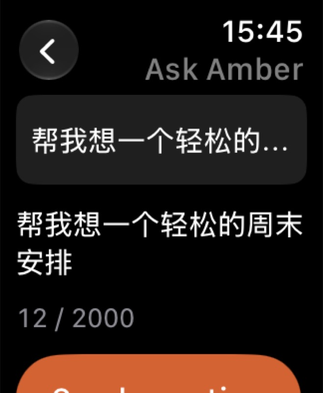
   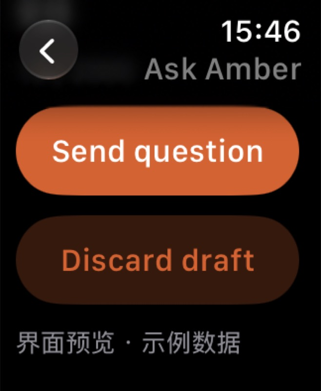

2. 手机设置 320×568：相同布局夹具，修改前配置说明省略，修改后完整换行。

   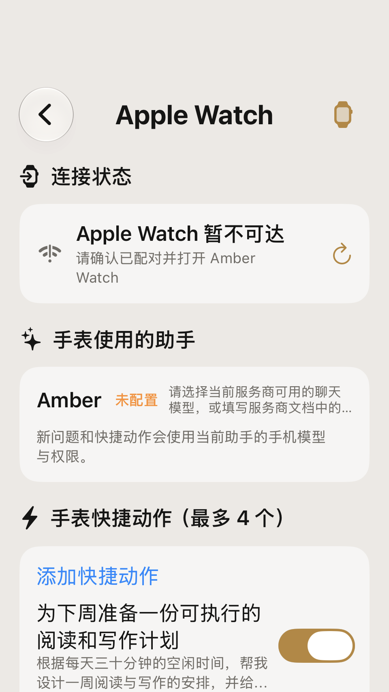
   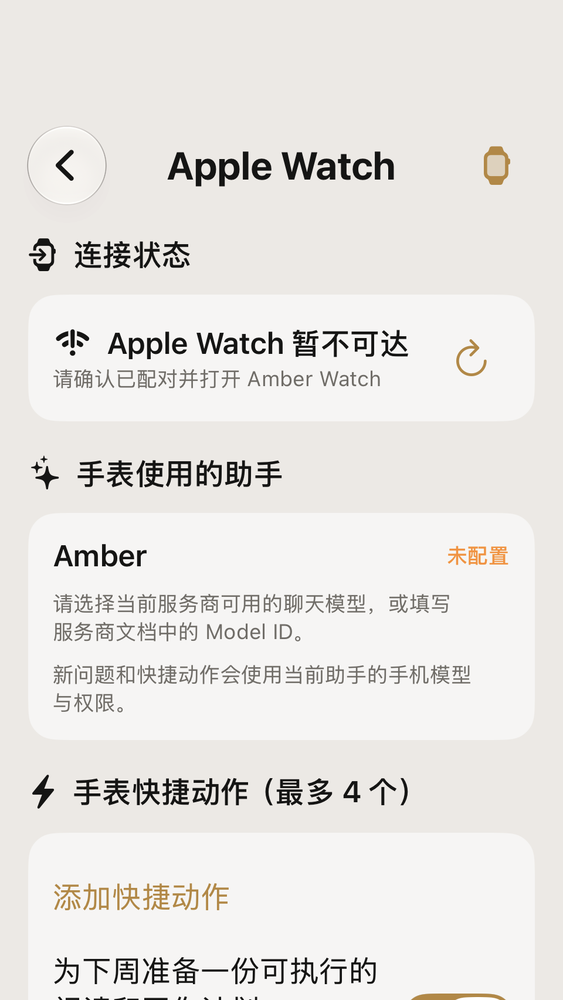

3. 手机设置 320×568、accessibility3：修改前横排挤压、图标与标题争抢空间，修改后标题和连接状态纵排。

   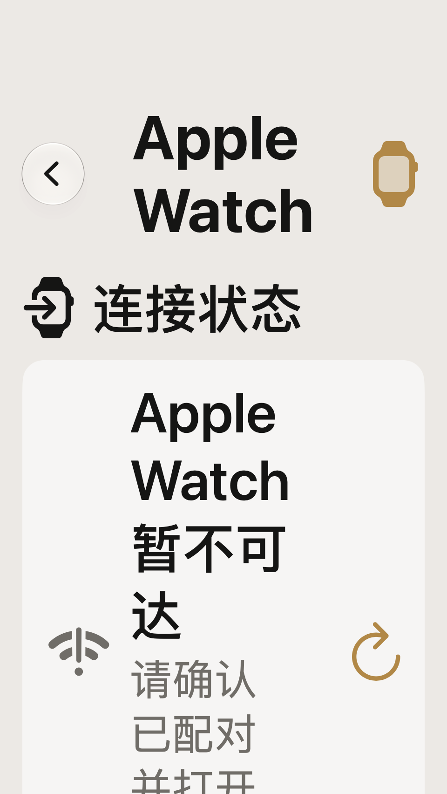
   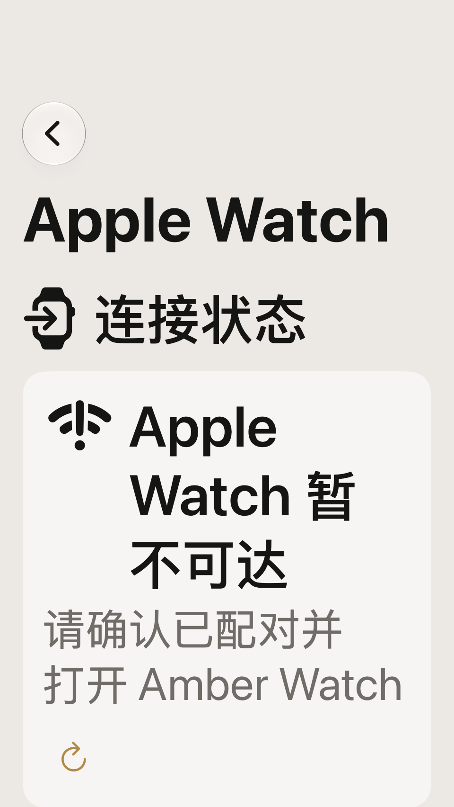

4. 40mm 俄文任务页面：捕获导航标题截断，使用短标题后复验。

   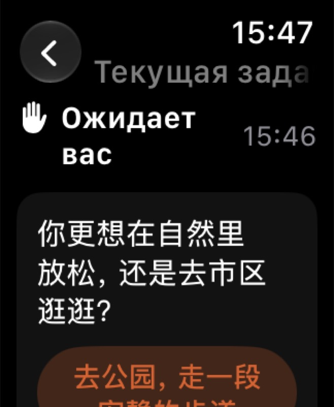
   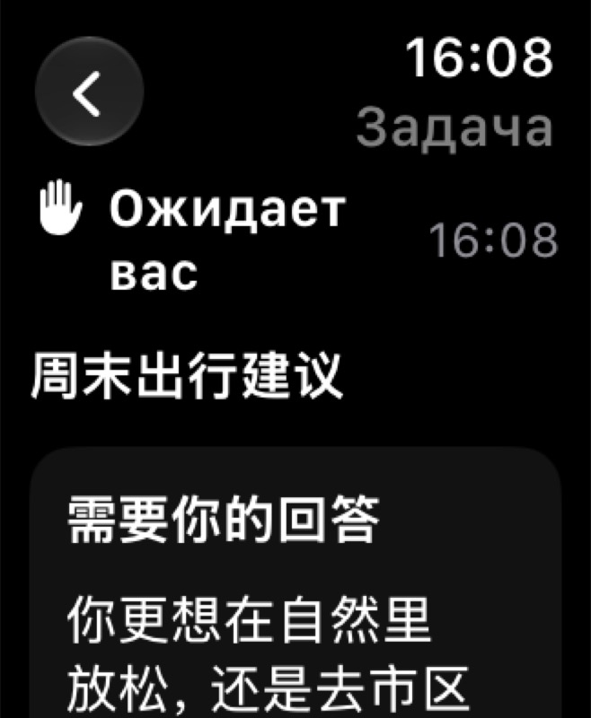

5. 40mm、xxxLarge：继续复验发现状态与时间争抢横向空间，改为自适应上下排列后状态完整。

   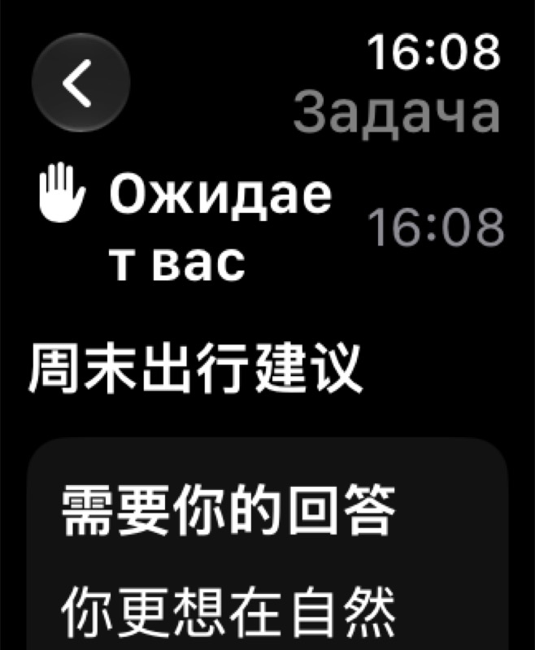
   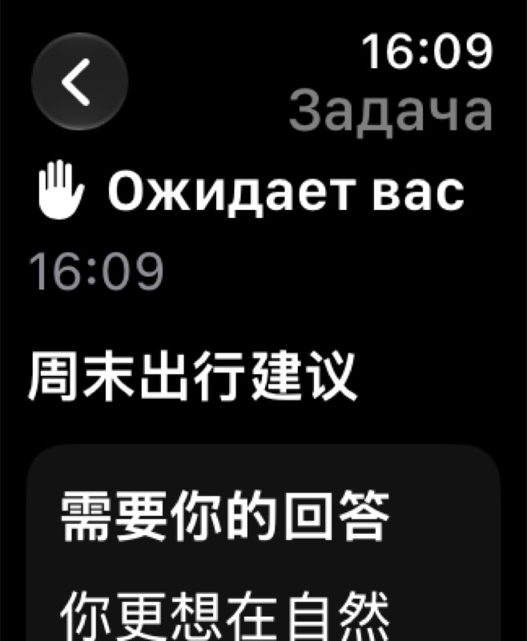

6. 46mm 实验版：任务标题、完成状态、时间与回答节选正常排列。

   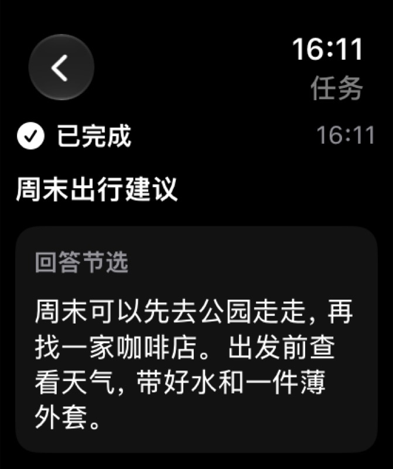

## 验证

- W1 回归：修改前同一问题重连后的答案为 ""，修改后保留原输入；新 decision 仍清除旧回答。
- W2 回归：修改前重新创建通知服务不能取消旧 identifier，修改后可取消。
- 第一轮修复后，WatchCompanionFlowTests、WatchNotificationTests、IOSLocalNotificationTests 与布局取证共 20 项通过。
- 布局测试只自动检查宽度约束并生成截图；视觉结论来自逐图人工检查，不以“测试通过”替代界面判断。
- 完整定向集 **149/149 通过**，包含冷启动、请求/离线笔记、回执、审批、通知、接力、设置接线、后台 run owner 与布局取证。
- 最后补齐快照请求保活和失效确认导航后，定向复跑 **31/31 通过**。本轮共有 **150 个不同相关用例通过**（149 项完整集 + 1 项新增快照保活用例，收尾复跑含重叠）。
- 正式与实验 Watch App 及 Widget 扩展均以最终共享通信代码构建并启动成功；iPhone 主应用通过定向测试构建。
- 新增三项固定文案的六语言覆盖、JSON 解析与 git diff --check 通过；没有新增依赖、提交或发布。

本轮日志：
- 收尾集：test_sim_2026-09-08T08-21-58-654Z_pid63831_a28a040d.log
- 完整集：test_sim_2026-09-08T08-16-51-463Z_pid63831_584dca33.log
- 正式 Watch：build_run_sim_2026-09-08T08-20-36-794Z_pid63831_aa648851.log
- 实验 Watch：build_run_sim_2026-09-08T08-20-58-204Z_pid63831_6786ca28.log

日志目录：/Users/mi/Library/Developer/XcodeBuildMCP/workspaces/ios-396633e5a58a/logs/。构建保留仓库既有弃用/并发警告；本轮发现的 UIKit actor 默认值和 static Self 编译错误均已修复，复跑没有错误。

## 验证边界

本轮曾实际操作模拟器完成 Watch 输入页滚动，但 Mac 随后重新锁屏，手机设置点击与系统输入对话框检查中断；已请求用户解锁。渲染取证和状态回归继续完成。

尚不能宣称通过真机发布验收：系统听写、VoiceOver 实际操作、触感、锁屏 WC 唤醒和通知转发、表盘安装与智能叠放仍需配对设备证据。截图覆盖窄屏与大字号布局，不代表完成全流程辅助功能认证。

## 收敛结论

**PARTIAL（代码与模拟器检查通过；设备交互验收仍有缺口）**。

- 可关闭：本轮台账中的代码缺陷、手机窄屏/大字号布局、Watch 短标题与长状态布局，以及已有回归覆盖的调用链。
- 保留待验：真实配对后台唤醒、系统输入/通知权限、VoiceOver/触感和手机设置逐步点击；此次没有将截图或 mock transport 测试描述为真机闭环证据。
- 下一步：在已解锁的 Mac 与配对 iPhone/Watch 上完成上述交互验收。

主要变更文件：WatchTaskRootView.swift、WatchTaskViewModel.swift、AmberWatchApp.swift、WatchConnectivityBridge.swift、WatchTaskCoordinator.swift、IOSWatchSettingsView.swift、IOSLocalNotifications.swift、AppShell.swift、Localizable.xcstrings；新增冷启动、保活和布局取证测试，扩展现有 Watch 流程/通知回归。
